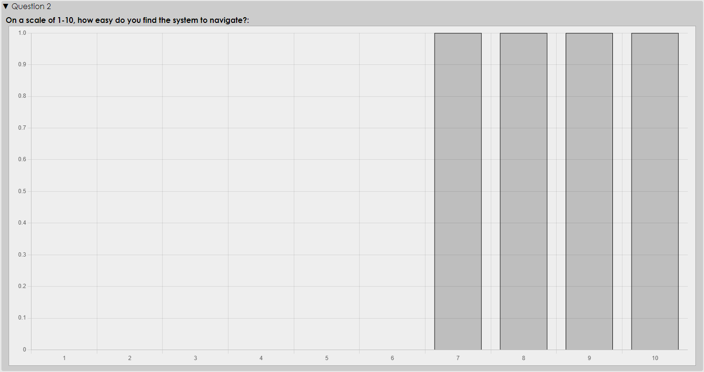
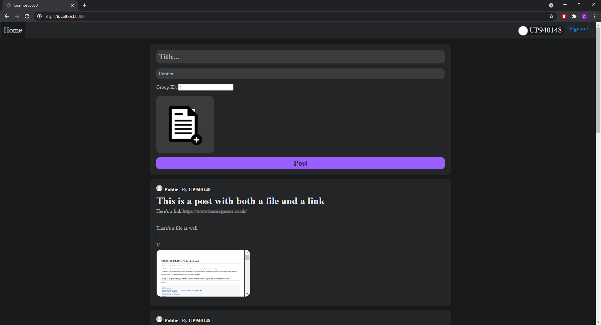

# UP940148 Peer Review System

## About this repository

This repository is set up for the development of UP940148's Application Engineering coursework.

## Installing

Clone this repository into a local directory and install the required dependencies by running the following command:

```shell
npm install
```

Errors when installing could be caused by a bug in `node-pre-gyp v0.11.0`. If an error occurs, use the following command to install:

```shell
npm install --build-from-source
```

*This command worked a couple of times on my VM, however it seems that SQLite3 failing to install at* `node-pre-gyp install --fallback-to-build` *is a common issue that requires updating or rolling back Node Versions, which I can't do on my VM*

**Last Resort:**

If installation continues to fail, I have a second version of `package-lock.json` in `./backup/`. This version was built at the end of the project, and it was built on the VM. I've tested it a bit and found no glaring issues, so replacing the file in the root with the file in the backup folder then running `npm install` should hopefully work

## Initialising

Before running the system, the database needs to be initialised with the following command:

```shell
npm run setup
```

**After** initialising the database, you can toggle between the database that was just created, and the database populated by users that tested the system. To do this, run the following command:

```shell
npm run db-swap
```

## Starting the application

To start the application, just run

```shell
npm start
```

The application will then be accessible from `localhost:8080`

(You can change to your preferred port by changing the value in `{ROOT}/config.js`)

## Interacting with the system

(Throughout this section, `*host*` will refer to the combination of the application's Hostname and port number)

When first launching the application at `*host*/`, you will be presented with a welcome page, from which you can log in to the system and access all of it's features. Attempting to access this welcome page whilst signed in will redirect you to `*host*/dashboard`, and inversely, attempting to access `*host*/dashboard` without being signed in will redirect you back to this welcome screen.

### Signing in

Upon first signing in, you will be directed to your profile page, from here you can update your name, and username, and update/delete your profile picture. You can also click on the 'Dashboard' button and be directed to your dashboard, or you can sign out and be directed back to the welcome page.

You can access your profile again at any time by clicking on your profile button in the top-right of your screen.

### Dashboard

Your dashboard is your primary hub, and will be the page you are presented with every time you log back into the system. From here you can view groups that you're registered with, search for new groups to join, and even create groups of your own. Any group invites you receive will be displayed here as well.

You can toggle between viewing the group tab, and viewing the post tab. When viewing the post tab, all of your posts will be displayed in order from newest to oldest.

If a group has a long name, or description, then you can click on that group's record to expand the record and show the full length.

### Groups

If a group is private, then it can only be accessed by users registered to it. Users can only register with private groups if they have received an invite from the group owner. Attempting to view a private group, or any of the posts within said group, without being registered to it, will result in a 404 error.

Public groups, and their content, can be viewed by any user of the system, whether the user is signed in or not.

The owner of a group can invite a user to join by searching for the user's username or email and inviting them

### Creating a post

Any member of a given group can make a post in that group. The only requirements of a post is that there must be a title and description, a post doesn't necessarily need to contain files, or feedback questions.

When creating a post, you can have maximum 20 files per post, with each file having a size limit of 50MB. You can ask as many questions as you like when creating a post, and reviewers can answer using either specific answers that you've pre-defined, or with free text. These feedback responses can then be viewed by you when you view your post.

### Viewing a post

When viewing a post, all uploaded files will be shown at the side of the screen, and users can click on them to open them in a new tab, or they can download them to their device. Files can be downloaded individually, or at once as a zip folder containing all the files in the post.

If you're viewing another user's post, you can leave feedback on their work, by answering the questions they made when creating the post.

If you're viewing your own work, you can view feedback that users have left on your work, set out in the form of bar charts for multiple choice questions, and text entries for text responses.

Bar chart visualisation of results


## Extra features

I found that when a user wanted to delete a post, because I was needing to delete all the content of the post, things started to slow down, and as a user, you might have to wait 30-60 seconds before the post finally deleted and you were redirected to the group page. This was because of `fs.unlink()`. Both synchronous and asynchronous versions took a long time, so I decided to implement a clean-up function to delete files. When a post is deleted or a profile picture is updated/deleted, paths to the files that need deleting are stored in a file, `redundants.txt`, and every 10 minutes the clean-up function deletes them. This allows users to delete files near instantaneously.

## Future work

- Downloadable feedback results
  - All the information required is already available, I just need to put it all together and allow a user to download it. I'm thinking `.csv` format is the best way to go about this
  - Unable to achieve until I figure out what changed with `res.download()`


- Downloadable posts
  - Same as downloadable feedback, however I would allow the user to download their entire post as a zip so that they could archive it if they wanted
  - Unable to achieve until I figure out what changed with `res.download()`


- On the dashboard, when searching for groups, if no search matches, or if no search entered, maybe display the most popular groups
  - Popularity can be determined by number of users registered and/or number of posts made (Could even check by number of posts made in the last X days)


- Optimise design for mobile
  - Currently the design is optimised primarily for mainstream computers which have a landscape display, with less consideration towards mobile users, however with some tweaking, the design could be easily optimised for mobile


- Implement an internal method of displaying files, so that people can't just navigate to a file's URL in order to view it through Chrome
  - I had this sort of thing set up nicely in my prototype system, however when I restarted the project and implemented the current system, something changed and `res.download(...)` stopped functioning in the same way. I could only get it to work if the client was directed directly to the request URL, which meant that I couldn't (in any way I know) check the userId and verify that the user had access to the file/s before allowing the download. So I want to research this issue a bit more and find the cause and a solution
  - Because of my issues with `res.download()`, I decided that it wasn't worth the extra time implementing a secure file viewer if it could be so easily circumvented by just requesting to download the files instead, hence this is future work
  - Maybe use `res.sendFile()`, and then have the client download the file with a href to `createObjectURL(file)`?


- Implement assignments
  - My database has tables for assignments and submissions already set up. The idea is that groups can have assignments set, with pre-defined marking criteria, which every member of the group can attempt. When the deadline hits, submissions will be stopped and the admin staff can assign feedback to each of the submissions


- Add the ability for users to save questions, and then load them in the future to reuse them


- Predict question responses
  - When a user creates a multiple choice question, they currently have to enter all responses manually. It would be good if the next response was predicted by taking the responses they just set into account


- Delete files that didn't make it to a post
  - Currently if a user attempts to create a post, or update their profile picture, the files go through the 'uploads' folder, before being moved to the 'saved' folder. However if posting fails, for whatever reason, the files will stay there, and won't be removed

## Reflections

Initially, I saw the coursework brief, and immediately had an idea of how I wanted the system to look, and so I started to design the style of the system, and implemented basic file upload features and a comment system, and then realised that, where I had such a refined idea of how I wanted this system to look, I'd locked myself into a design that didn't give me the space to implement many, if any, useful features. So I had to step back and restart my design in order to implement a more practical system.

Initial design:


I also had to make some changes to my database design throughout the project because, again, I found the initial design to be too limiting. I designed the database at the same time as the layout, rather than designing the database and then the layout. This, again, meant I got locked in with a system that had no room to grow

In order to properly stress test my system, I allowed users to access it and treat it as they would any other system. This helped me find bugs and fix them which helped a lot in development. However, rather unsurprisingly, I ended up with a couple of users posting what they wanted to, rather than what I wanted them to. This made me realise that, no matter how well I design a system to do something, users won't always use my system in the way I expect them to, and the way I designed it to be used. Users will use systems however they want. I decided not to delete posts and files that don't reflect what I was expecting, as I think that would have given a biased representation of the system, which would render the testing useless.
