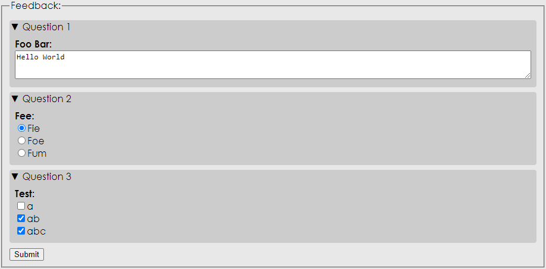

# API Version 2

## User routes

- POST `<root>/user` - Create user profile from Google Profile
  - returns `201` on success
  - returns `401` if valid Google `idToken` not provided in Authorization header


- GET `<root>/user` - Retrieves current user profile as JSON object
  - returns `200` with user object on success
    - User object returns as:
    ```
      {
        userId: string (unique identifier for each user),
        username: string (unique for each user),
        name: string,
        email: string,
        picture: string,
        savedQuestions: string,
      }
    ```
  - returns `401` if valid Google `idToken` not provided in Authorization header
  - returns `404` if user profile not found


- GET `<root>/profile-pic/:userId?` - retrieves user profile picture
  - returns `200` with attached file
    - if `userId` not provided or user profile picture not found, default file returned
    - if user profile picture found successfully, user's profile picture file returned


- PATCH `<root>/user` - Updates current user profile (accepts FormData)
  - incoming FormData should be in the form:
  ```
    newUsername: string (max 20 chars, must be unique in user table),
    newName: string,
  ```
  - returns `204` on success
  - returns `400` if request data is malformed
  - returns `401` if valid Google `idToken` not provided in Authorization header
  - returns `404` if user profile not found


- PATCH `<root>/profile-pic` - updates current user profile picture (accepts FormData)
  - incoming FormData should be in the form:
  ```
    picture: file (max file size 25MB, accepted mimetypes: image/*)
  ```
  - if no FormData provided, existing picture is deleted
  - returns `204` on success

## Cohort routes

- POST `<root>/cohort/cohortId?` - Create new cohort (accepts FormData)
  - If `cohortId` provided, then the cohort information is updated
    - `cohortId` must be parsable as integer
  - incoming FormData should be in the form:
  ```
    cohortName: string (non-empty, max 32 chars),
    cohortDesc: string (non-empty, max 128 chars),
    isPrivate: any (if interpreted as null entry, assumed as False, else True),
  ```
  - returns `201` on successful creation
  - returns `204` on successful update
  - returns `400` if request data is malformed
  - returns `401` if valid Google `idToken` not provided in Authorization header
  - returns `404` if updating and cohort not found or user not registered as cohort owner


- GET `<root>/cohort/:cohortId` - Retrieves requested cohort data as JSON object
  - returns `200` with cohort object on success
    - cohort object returns as:
    ```
      {
        cohortId: integer (unique identifier for each cohort),
        name: string,
        description: string,
        isPrivate: integer (0 or 1),
      }
    ```
  - returns `400` if `cohortId` is invalid
  - returns `404` if cohort not found or user denied access


- GET `<root>/cohorts` - Retrieves list of cohorts that user is registered with
  - returns `200` with list of cohort objects (defined above) on success
  - returns `204` if no registered cohorts found
  - returns `401` if valid Google `idToken` not provided in Authorization header


- GET `<root>/cohorts/:query` - Retrieves list of cohort objects whose names contain `query`
  - `query` should be a URI encoded string
  - returns `200` with list of cohort objects (defined above) on success
  - returns `204` if no matches found
  - returns `401` if valid Google `idToken` not provided in Authorization header


## Registration routes

- POST `<root>/register/:cohortId` - Register current user with specified public cohort
  - returns `204` on success
  - returns `400` if `cohortId` is invalid
  - returns `401` if valid Google `idToken` not provided in Authorization header
  - returns `404` if public cohort not found


- GET `<root>/registration/:cohortId` - Retrieves current user's registered rank with specified cohort as JSON object
  - returns `200` with registration object on success
    - registration object returns as:
    ```
      {
        rank: string ('guest', 'member', or 'owner'),
      }
    ```
  - returns `400` if `cohortId` is invalid
  - returns `401` if valid Google `idToken` not provided in Authorization header


## Invite routes

- POST `<root>/invite/:cohortId` - Send cohort invite to specified users (accepts FormData)
  - incoming FormData should be in the form:
  ```
    userIds: string (comma separated list of userIds)
  ```
  - returns `204` on success
  - returns `400` if request data is malformed
  - returns `401` if valid Google `idToken` not provided in Authorization header
  - returns `404` if current user not cohort owner


- POST `<root>/accept-invite/:inviteId` - Accepts specified invite and adds user to relevant cohort
  - returns `204` on success
  - returns `400` if `inviteId` is invalid
  - returns `401` if valid Google `idToken` not provided in Authorization header
  - returns `404` if specified invite not found with the current user


- GET `<root>/invites` - Retrieves list of JSON invite objects belonging to the current user
  - returns `200` with invite list on success
    - invite objects return as:
    ```
      {
        inviteId: integer (unique identifier for each invite),
        cohortId: integer (matches an existing cohort's id),
        userId: string (matches an existing user's id),
        message: string (currently unused),
      }
    ```
  - returns `204` if no invites found
  - returns `401` if valid Google `idToken` not provided in Authorization header


- GET `<root>/inviteable-users/:cohortId/:query` - Retrieves list of JSON objects of inviteable users with a username or email containing `query`
  - `query` should be a URI encoded string
  - returns `200` with user list on success
    - inviteable user objects return as:
    ```
      {
        userId: string (matches an existing user's id),
        username: string,
      }
    ```
  - returns `204` if no matches found
  - returns `400` if `cohortId` is invalid
  - returns `401` if valid Google `idToken` not provided in Authorization header


- DELETE `<root>/decline-invite/:inviteId` - Deletes specified invite
  - returns `204` on success
  - returns `400` if `inviteId` is invalid
  - returns `401` if valid Google `idToken` not provided in Authorization header
  - returns `404` if specified invite not found with the current user

## Post routes (For user posts, not routes using the POST method)

- POST `<root>/post/:cohortId` - Create new post (Accepts FormData)
  - incoming FormData should be in the form:
  ```
    postTitle: string (non-empty, max 128 chars),
    postDesc: string (non-empty),
    file: file (max file size 50MB, max file count 20, accepted mimetypes: image/*, audio/*, application/pdf, application/zip),
    questions: JSON Object (must contain attribute 'questions', which must contain a list of question objects)
  ```
  - question object should be in the form:
  ```
    {
      question: string,
      type: string ('text', 'radio', or 'checkbox'),
      answers: array (list of allowed answers - leave undefined for 'text' question types),
      save: boolean (True if saving as preset, else False),
    }
  ```
  - returns `201` on success
  - returns `400` if request data is malformed
  - returns `401` if valid Google `idToken` not provided in Authorization header
  - returns `404` if current user not registered in cohort


- GET `<root>/post/:postId` - Retrieve JSON post object
  - returns `200` with post object on success
    - post object returns as:
    ```
      {
        postId integer (unique identifier for each post),
        title string,
        description string,
        files string,
        timeCreated integer (Unix timestamp),
        criteriaId integer (matches an existing criteria's id),
        cohortId integer (matches an existing cohort's id),
        userId string (matches an existing user's id),
        username string,
      }
    ```
  - returns `400` if `postId` invalid
  - returns `404` if post not found for user


- GET `<root>/posts/:cohortId?` - Retrieve list of JSON post objects
  - if `cohortId` specified, then response will be posts in the specified cohort
    - returns `200` with list of cohort post objects on success
      - cohort post objects return as:
      ```
        {
          postId: integer (unique identifier for each post),
          title: string,
          description: string,
          files: string,
          timeCreated: integer (Unix timestamp),
          criteriaId: integer (matches an existing criteria's id),
          userId: string (matches an existing user's id),
          username: string,
        }
      ```
  - if `cohortId` not specified, then response will be all posts the current user has made
    - returns `200` with list of user post objects on success
      - user post objects return as:
      ```
        {
          postId: integer (unique identifier for each post),
          registrationId: integer,
          title: string,
          description: string,
          files: string,
          timeCreated: integer (Unix timestamp),
          criteriaId: integer (matches an existing criteria's id),
          cohortId: (matches an existing post's id),
          userId: (the current user's id),
          rank: string ('guest', 'member', or 'owner'),
        }
      ```
  - returns `204` if no posts found
  - returns `400` if attempting to get own posts when current user not logged in
  - returns `404` if posts not available for user


- DELETE `<root>/post/:postId` - Deletes specified post, including relevant files and question responses
  - returns `204` on success
  - returns `400` if `postId` invalid
  - returns `401` if valid Google `idToken` not provided in Authorization header
  - returns `404` if current user can't delete post

## Criteria routes

- GET `<root>/questions/:criteriaId` - Retrieves criteria questions as a list of JSON objects
  - returns `200` with list of question objects on success
    - question objects return as:
    ```
      {
        questionId: integer (unique identifier for each question),
        questionContent: string,
        type: string ('text', 'radio', or 'checkbox'),
        answers: array (list of allowed answers as strings),
      }
    ```
  - returns `204` if no questions found
  - returns `400` if `criteriaId` is invalid
  - returns `404` if criteria not found


- GET `<root>/questions` - Retrieves questions that the user has saved as a list of JSON objects
  - returns `200` with list of question objects (defined above) on success
  - returns `204` if no saved questions found
  - returns `401` if valid Google `idToken` not provided in Authorization header

## Response routes

- POST `<root>/response/:postId` - Creates a set of responses to the specified post's questions (accepts FormData)
  - incoming FormData should be in the form:
  ```
    question{X}: string (this format is how responses are submitted for 'text' and 'radio' question types),
    question{X+1}answer{Y}: string (any string here is represented as this answer being selected. this format is how responses are submitted for 'checkbox' question type),
  ```
    - where `X` and `Y` are integers
    - `X` represents the question's index in the criteria list (first question index starts at 0)
    - `Y` represents the selected answer, relative to `questionX`. The index for possible answers starts at 0

    Example

      

    would be represented as:
    ```
      question0: 'Hello World!',
      question1: 'Fie',
      question2answer1: 'on',
      question2answer2: 'on',
    ```

  - returns `201` on success
  - returns `400` if request data is malformed
  - returns `401` if valid Google `idToken` not provided in Authorization header
  - returns `404` if answerable question/s not found


- GET `<root>/response-stats/:postId` - Retrieves response statistics for the specified post's questions as a list of JSON objects
  - returns `200` with list of response statistics objects on success
    - response statistic objects return as:
    ```
      {
        question: string,
        type: string ('text', 'radio', or 'checkbox'),
        responses: array (Array of strings, where each string is an answer from a user. Undefined for 'radio' and 'checkbox' question types),
        answers: array (Array of strings, where each string is a possible answer. Undefined for 'text' question type),
        totals: array (Array of integers, where totals[i] = the number of times that answers[i] was selected. Undefined for 'text' question type),
      }
    ```
  - returns `400` if `postId` invalid
  - returns `401` if valid Google `idToken` not provided in Authorization header
  - returns `404` if responses not found for this user

## File routes

- GET `<root>/file/:fileId` - Sends the file with the specified id
  - returns `200` with file on success
  - returns `404` if specified file not found


- GET `<root>/img/:imageId` - Sends the image with the specified id
  - returns `200` with file on success
  - returns `404` if specified file not found


- GET `<root>/download/:fileId` - Downloads the file with the specified id
  - returns `200` with file as attachment on success
  - returns `404` if specified file not found


- GET `<root>/download-all/:postId` - Downloads all files of a given post as a single .zip folder
  - returns `200` with file on success
  - returns `204` if post has no files
  - returns `400` if `postId` invalid
  - returns `404` if post not found

## Miscellaneous routes

- GET `<root>/username/:username` - Checks if provided username is unique, returns JSON object
  - returns `200` on success
    - returns JSON `{ unique: true }` or `{ unique: false }`
  - returns `401` if valid Google `idToken` not provided in Authorization header


<!--
check for stray 201 statuses
convert 200 responses with no data to 204
-->
