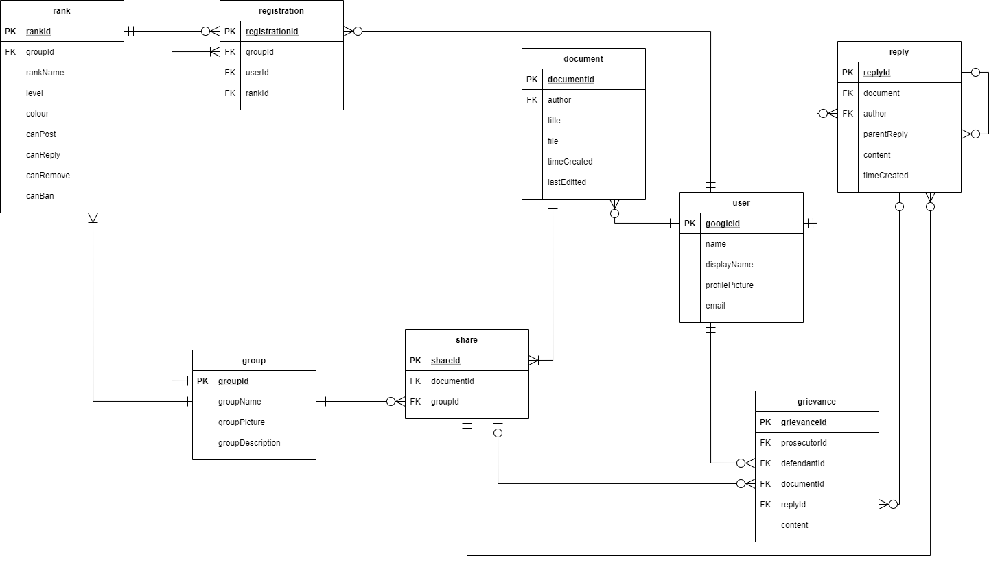

# Database design

## Entity Relationship Diagram



ERD has been updated since data dictionary creation

---

## Data Dictionary and SQL

### User

The user table stores information about user profiles

|Attribute|PK/FK|Data Type|FK Ref|Description|
|---|---|---|---|---|
|googleId|PK|||The Google ID associated with the user account|
|name||text||The name of the user|
|displayName||text||The display name the user sets|
|profilePicture||text||The url associated with the uploaded profile picture|
|email||text||The user's email address *(Slightly redundant field)*|

```sql
CREATE TABLE IF NOT EXISTS user (
  googleId PRIMARY KEY NOT NULL,
  name text NOT NULL,
  displayName text,
  profilePicture text,
  email text UNIQUE NOT NULL
);
```

---

### Groups

The groups table stores information about different groups/pages that have been created

|Attribute|PK/FK|Data Type|FK Ref|Description|
|---|---|---|---|---|
|groupId|PK|integer||The unique id of the group|
|groupName||text||The group's given name|
|groupPicture||text||The url associated with the uploaded group picture|
|groupDescription||text||A brief description about the group|

```sql
CREATE TABLE IF NOT EXISTS groups (
  groupId INTEGER PRIMARY KEY AUTOINCREMENT,
  groupName text NOT NULL,
  groupPicture text,
  groupDescription text
);
```

---

### Document

The document table stores information about work that has been uploaded to the database

|Attribute|PK/FK|Data Type|FK Ref|Description|
|---|---|---|---|---|
|documentId|PK|integer||The unique id of the piece of work|
|author|FK||user(googleId)|The id of the work's author|
|title||text||A title given to the piece of work|
|file||text||The url associated with the uploaded document|
|timeCreated||integer||The time the work was uploaded in Unix Time(?)|
|lastEditted||integer||The time the work was updated in Unix Time(?)|

```sql
CREATE TABLE IF NOT EXISTS document (
  documentId INTEGER PRIMARY KEY AUTOINCREMENT,
  author references user(googleId) NOT NULL,
  title text NOT NULL,
  file text NOT NULL,
  timeCreated integer NOT NULL,
  lastEditted integer
);
```

---

### Share

The share table stores information about what groups can see different documents

|Attribute|PK/FK|Data Type|FK Ref|Description|
|---|---|---|---|---|
|shareId|PK|integer||The unique id of the work's share status|
|documentId|FK||document(documentId)|The id of the document being shared with the group|
|groupId|FK||groups(groupId)|The id of the group that the document is being shared with|

```sql
CREATE TABLE IF NOT EXISTS share (
  shareId INTEGER PRIMARY KEY AUTOINCREMENT,
  documentId references document(documentId),
  groupId references groups(groupId)
);
```

---

### Rank

The rank table holds information about what ranks exist within groups

|Attribute|PK/FK|Data Type|FK Ref|Description|
|---|---|---|---|---|
|rankId|PK|integer||The unique id of this rank|
|groupId|FK||groups(groupId)|The id of the group that this rank belongs to|
|rankName||text||A name/title given to this rank|
|level||integer||The level of this rank. Used for permissions|
|colour||text||The colour of this rank's title (cosmetic only)|
|canPost||integer||Boolean value for permission|
|canReply||integer||Boolean value for permission|
|canRemove||integer||Boolean value for permission|
|canBan||integer||Boolean value for permission|

```sql
CREATE TABLE IF NOT EXISTS rank (
  rankId INTEGER PRIMARY KEY AUTOINCREMENT,
  groupId references groups(groupId),
  rankName text NOT NULL,
  level integer NOT NULL,
  colour text,
  canPost integer NOT NULL,
  canReply integer NOT NULL,
  canRemove integer NOT NULL,
  canBan integer NOT NULL
);
```

---

### Registration

The registration table holds information about what users are members of which groups

|Attribute|PK/FK|Data Type|FK Ref|Description|
|---|---|---|---|---|
|registrationId|PK|integer||The unique id of this registration|
|userId|FK||user(googleId)|The id of the user signed up to the group|
|groupId|FK||groups(groupId)|The id of the group that the user is a member of|
|rankId|FK||rank(rankId)|The id of the rank that the user holds|

```sql
CREATE TABLE IF NOT EXISTS registration (
  registrationId INTEGER PRIMARY KEY AUTOINCREMENT,
  userId references user(googleId),
  groupId references groups(groupId),
  rankId references rank(rankId)
);
```

---

### Reply

The reply table stores comments and replies on posts

|Attribute|PK/FK|Data Type|FK Ref|Description|
|---|---|---|---|---|
|replyId|PK|integer||The unique id of this comment|
|author|FK||user(googleId)|The id of the user that made the comment|
|document|FK||share(shareId)|The id of the post that the comment is associated with|
|parentReply|FK||reply(replyId)|The id of the comment that is being replied to (if applicable)|
|content||text||The content of the comment|
|timeCreated||integer||The time the comment was created in Unix Time(?)|

```sql
CREATE TABLE IF NOT EXISTS reply (
  replyId INTEGER PRIMARY KEY AUTOINCREMENT,
  author references user(googleId) NOT NULL,
  document references share(shareId) NOT NULL,
  parentReply references reply(replyId),
  content text NOT NULL,
  timeCreated integer NOT NULL
);
```

---

### Grievance

The grievance table stores information about users that have been reported

|Attribute|PK/FK|Data Type|FK Ref|Description|
|---|---|---|---|---|
|grievanceId|PK|integer||The unique id of this grievance|
|prosecutorId|FK||user(googleId)|The id of the user filing the grievance|
|defendantId|FK||user(googleId)|The id of the user being reported|
|documentId|FK||share(shareId)|The id of the post being reported|
|replyId|FK||reply(replyId)|The id of the comment being reported|
|content||text||The message to go with the report|

```sql
CREATE TABLE IF NOT EXISTS grievance (
  grievanceId INTEGER PRIMARY KEY AUTOINCREMENT,
  prosecutorId references user(googleId),
  defendantId references user(googleId),
  documentId references share(shareId),
  replyId references reply(replyId),
  content text
);
```
